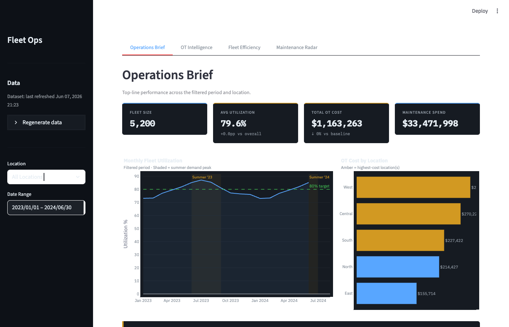
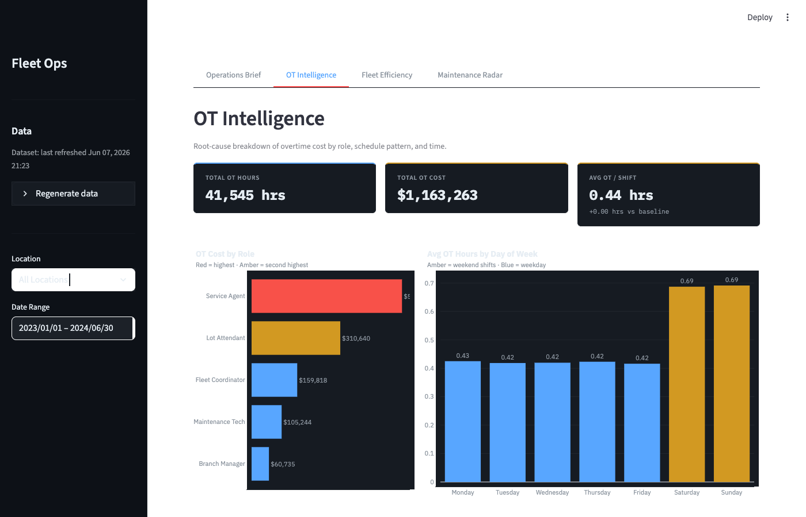
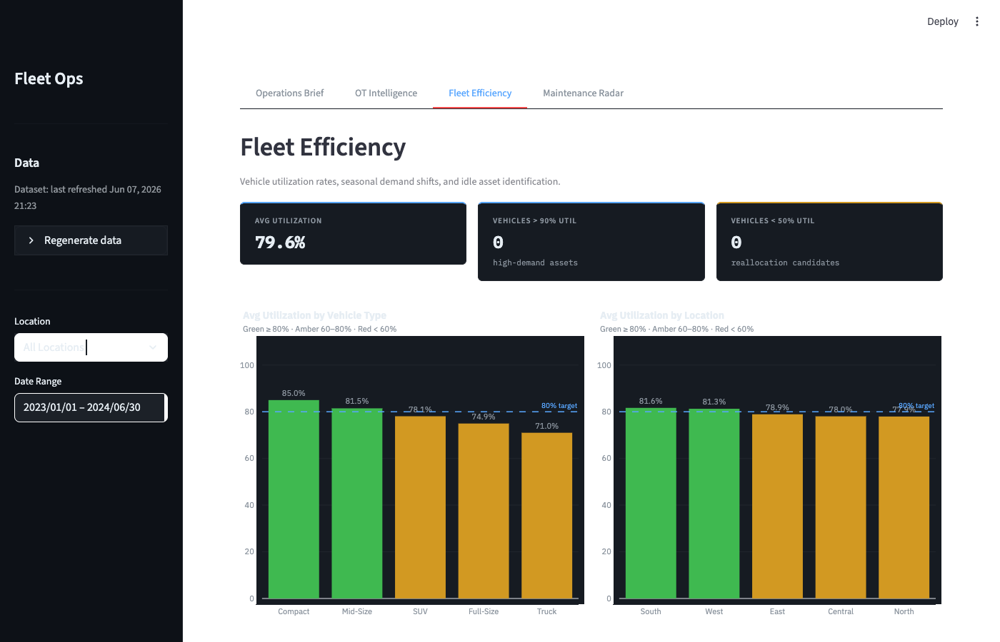
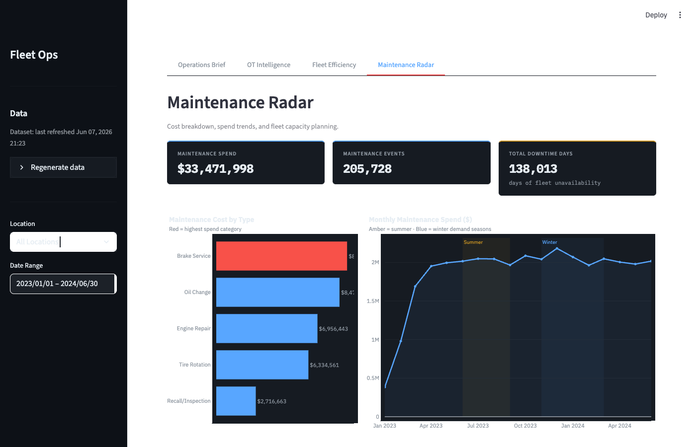

# Fleet Ops Analytics

Interactive analytics dashboard for a 5,200-vehicle fleet — utilization, overtime costs, efficiency, and maintenance tracking.




---

## Dashboard Views

**Operations Brief** — Fleet-wide utilization rate, daily trends, and operational KPIs.


**OT Intelligence** — Overtime spend breakdown by location and driver, cost variance analysis.



**Fleet Efficiency** — Vehicle utilization distribution, outlier identification, and efficiency scoring.



**Maintenance Radar** — Maintenance frequency, cost tracking, and vehicle status by type.



---

## Getting Started

**Prerequisites:** Python 3.10+

```bash
git clone https://github.com/DCodeBase-X/fleet-ops-analytics.git
cd fleet-ops-analytics
pip install -r requirements.txt
streamlit run dashboard/app.py
```

To run the deep-dive analysis notebook:

```bash
jupyter notebook notebooks/fleet_analysis.ipynb
```

---

## Project Structure

```
fleet-ops-analytics/
├── dashboard/        # Streamlit app — config, data loading, charts, entry point
├── data/             # Source CSV files (synthetic fleet data, 4 files)
├── notebooks/        # Jupyter notebook with DuckDB SQL analysis
├── tests/            # Pytest test suite
├── visuals/          # Dashboard screenshots
└── requirements.txt
```

---

## License

MIT © 2026 Damarius McNair
